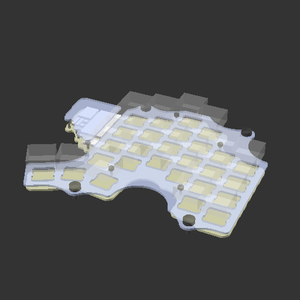
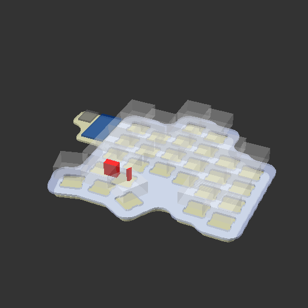

# More organic

Last time (five-by-six) Freecad was used to achieve the parametric design of plate and rest of case parts.

Now, the whole design is more complicated. When keys were purely orthogonal, Freecad handled that easily with multi transform, but column stagger + thumb cluster is a bit more challenging.

OpenSCAD with SolidPython was choosen to support CAD design.

There is a couple of interdigitated parts in this project. Initially, the idea was to define everything in `make` dependencies, but that didn't work out. For example: case depends on switches placement (which are placed with script), but also manually placed elements on a PCB itself (uC, jack, etc). But PCB depends on a case itself, as PCB edge definition comes from it...

Whole workflow ended up as a subset of action from `Makefile`, saved intermediate design files within the repo itself (.scaf, .dxf, .json data dumps).

This board might be really similar to quite a few already existing great boards out there. An addition knob would be also nice.

# Parts of this project

## Design

The design of shared data, like:

- keys and diode positions
- mounting holes (pcb to plate, plate standoffs)

... is generated from `design/design.py` file. A bit of a math, logic and magic numbers (hand measurments, etc).

## Case

With use of SolidPython and dump of the footrpints from PCB, the whole assembly of plate, cover and pcb design is generated:

Additionally, a collisions are shown in red (need of a manual validation):

The whole idea for this design is to be kind of _organic_. Edges are naturally created form particular elements being _melted_ with each other. I am proud of that one.

Footprints from KiCAD were "redesigned" in OpenSCAD as well (basic shapes).

Different coordinate system between this 2 worlds (KiCAD and OpenSCAD) is not fun. Also, KiCAD and it's weird `(0, 0)` placement.

Also, this board doesn't have a bottom plate.

From python scripts .scad files are baked, then .dxf and images. .dxf are used as a PCBs edge lines (for main PCB, cover and plate).

## PCB

Ordinary PCB design. Needs manual routing followup after every `make pcb-place` is invoked, manual PCB edge reload from case's .dxf.

There is a small chaos in submodules and parts actually being used. The really used one, should be:

- [Keebio-Parts.pretty](github.com:keebio/Keebio-Parts.pretty)
- [keebio-components](github.com:keebio/keebio-components)
- [keyswitches.pretty](github.com/maciejmatczak/keyswitches.pretty), forked from [daprice's](github.com/daprice/keyswitches.pretty); I additionally modify one footprint to be reversible

# Afterthoughts

Scripting backup is great. But a really well thought and defined data flow needs be designed first to keep everything well working with each other in a more complicated design like this.

Clean stages of project are a key, I believe. Imagine if your work had to be done by different engineers. Mechanical design, electrical design. Which parts of a project are a common data that needs to be agreed and locked? And how to validate if you didn't mess up with some updates?

In a middle of a design, there would be a need to change something - for sure! The changes in the _root_ should naturally produce a dependant actions to follow up (that's should be clearly visible). Steps should be clear.

Status quo is not exactly how I was imaging it, but with recent RSI issues being more severe, this project took longer than I thought. And one failed fabrication ;).

Highlights:

- KiCAD design scripting
  - data dumpers from a KiCAD PCB
  - footprint placers from such dump - with filtering included
- OpenSCAD and SolidPython
  - idea for a companion libraries (to KiCAD's)
- General project validation - pytest suite
  - checking characteristic elements in designs (number of holes)
  - proper file age (drc report should be **younger** than a design itself)
